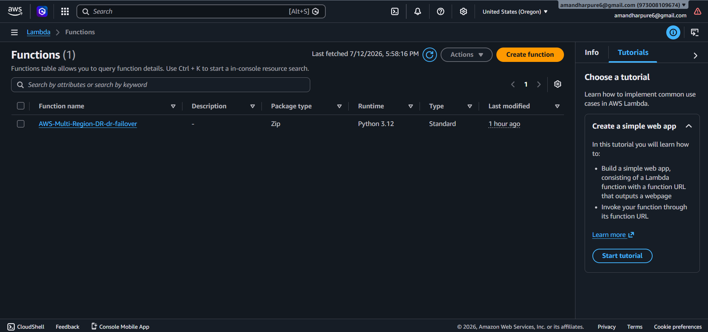
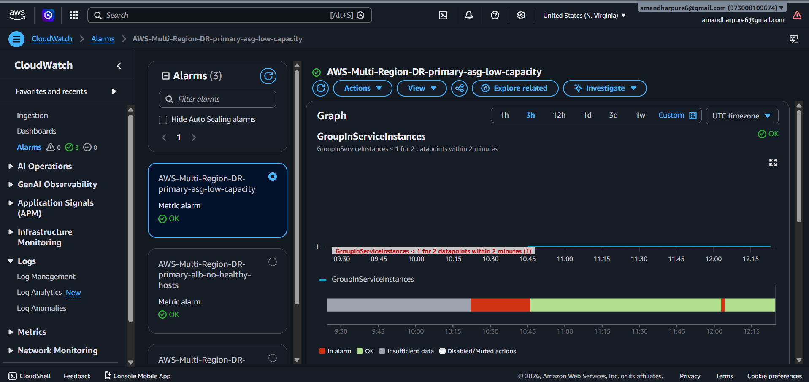
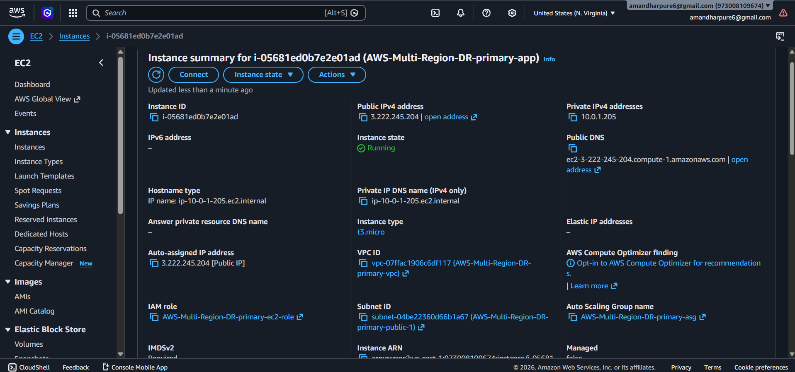
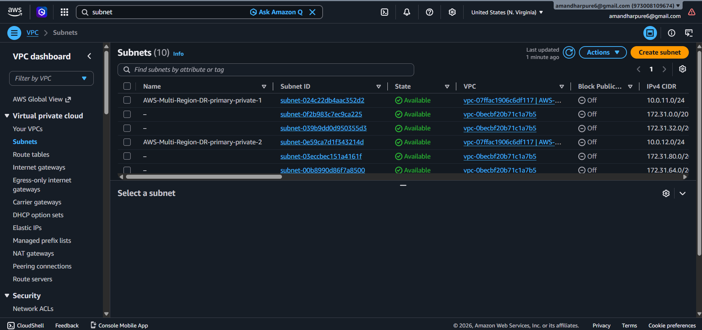
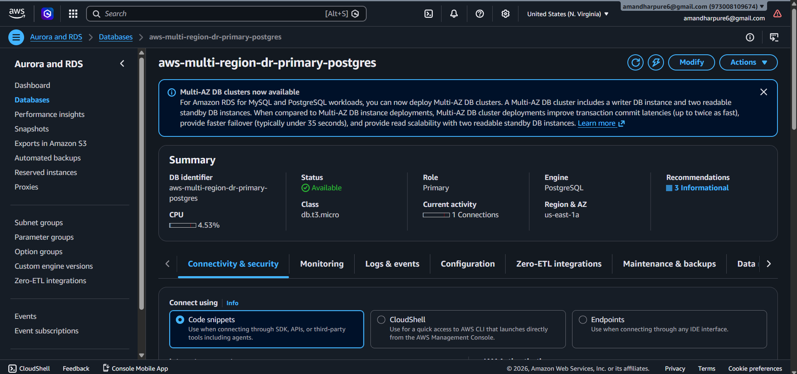
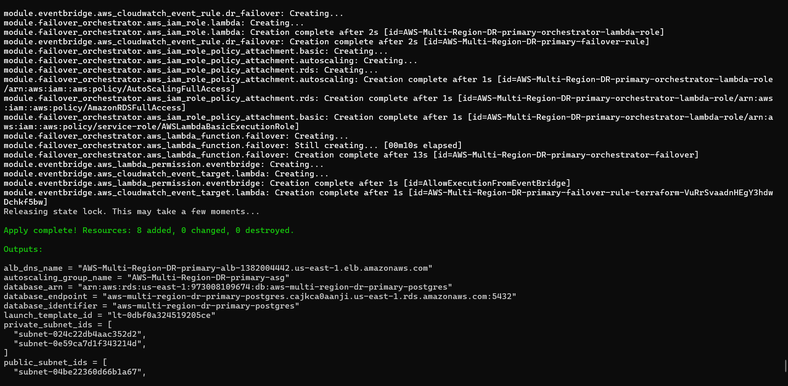

# 🌍 AWS Multi-Region Disaster Recovery Architecture

### Production-Grade Disaster Recovery Solution using Terraform & AWS


---

Production-ready Disaster Recovery Architecture built on AWS using Terraform.

Designed to automatically recover workloads from a Regional Failure while maintaining High Availability, Scalability and Infrastructure as Code.

</div>

---

# 📖 Project Overview

This project demonstrates how enterprise applications can survive a complete AWS Regional outage using Infrastructure as Code and AWS-native Disaster Recovery services.

The architecture deploys identical infrastructure in two AWS Regions.

- **Primary Region:** us-east-1
- **Disaster Recovery Region:** us-west-2

If the primary region becomes unavailable, traffic automatically fails over to the DR region using Amazon Route53.

---

## 🏗 AWS Architecture Diagram

<p align="center">
  
</p>
<p align="center">
<b>Production-Grade Multi-Region Disaster Recovery Architecture</b><br>
Built with AWS, Terraform, Route53, Auto Scaling, CloudWatch, SNS, Amazon RDS and Amazon S3.
</p>

---

## Architecture Highlights

- 🌎 **Primary Region:** us-east-1 (Active)
- 🌎 **Disaster Recovery Region:** us-west-2 (Standby)
- 🌐 **Amazon Route 53** performs DNS health checks and automatic failover.
- ⚖️ **Application Load Balancer** distributes traffic across multiple EC2 instances.
- 📈 **Auto Scaling Groups** ensure high availability and elasticity.
- 💾 **Amazon RDS Cross-Region Replication** keeps the standby database synchronized.
- 🪣 **Amazon S3 Cross-Region Backup** protects application backups.
- 📊 **Amazon CloudWatch** continuously monitors infrastructure health.
- 🔔 **Amazon SNS** sends real-time email alerts for failures and alarms.
- 🏗️ **Terraform** provisions and manages the entire infrastructure as code.

---

# 🚀 Architecture Components

| Service | Purpose |
|----------|----------|
| Amazon VPC | Network Isolation |
| EC2 | Application Servers |
| Auto Scaling | High Availability |
| Application Load Balancer | Traffic Distribution |
| Route53 | DNS Failover |
| CloudWatch | Monitoring |
| SNS | Alert Notifications |
| Terraform | Infrastructure as Code |
| S3 | Backup Storage |
| IAM | Secure Access |

---

# 🌎 Disaster Recovery Workflow

```text
User

↓

Route53

↓

Primary Load Balancer

↓

Auto Scaling Group

↓

Application Servers

↓

Primary Database

↓

CloudWatch Health Check

↓

If Region Fails

↓

Route53 Failover

↓

Secondary Load Balancer

↓

Secondary Auto Scaling Group

↓

Secondary EC2

↓

Standby Database

↓

Application Restored
```

---

# ⚡ Features

✅ Multi Region Deployment

✅ Infrastructure as Code

✅ High Availability

✅ Disaster Recovery

✅ Route53 Automatic Failover

✅ Auto Scaling

✅ Application Load Balancer

✅ CloudWatch Monitoring

✅ SNS Email Alerts

✅ Cross Region Backups

---

# 📂 Repository Structure

```
AWS-Multi-Region-DR/

│

├── modules/

│ ├── vpc/

│ ├── alb/

│ ├── ec2/

│ ├── autoscaling/

│ ├── security-group/

│ └── monitoring/

│

├── environments/

│ ├── primary/

│ └── secondary/

│

├── screenshots/

├── diagrams/

├── README.md

└── terraform.tfvars

```

---

# 🛠 Tech Stack

- AWS EC2
- AWS VPC
- Route53
- Auto Scaling
- Application Load Balancer
- CloudWatch
- SNS
- IAM
- S3
- Terraform
- Git
- GitHub

---

# ⚙ Deployment

Clone repository

```bash
git clone https://github.com/AmanDharpure/AWS-Multi-Region-DR.git
```

Initialize Terraform

```bash
terraform init
```

Validate

```bash
terraform validate
```

Plan

```bash
terraform plan
```

Deploy

```bash
terraform apply
```

Destroy

```bash
terraform destroy
```

---

# 📊 Monitoring

CloudWatch continuously monitors

- EC2 Health
- CPU Utilization
- Status Checks
- Auto Scaling
- Application Availability

When a failure occurs

CloudWatch

↓

SNS

↓

Email Notification

↓

Route53 Failover

↓

Traffic redirected to DR Region

---

# 📸 Project Screenshots

## 🚀 Auto Scaling Group

<p align="center">
  
</p>

---

## ⚡ AWS Lambda Function

<p align="center">
  
</p>

---

## 📊 Amazon CloudWatch

<p align="center">
  
</p>

---

## 💻 Amazon EC2 Instances

<p align="center">
  
</p>

---

## 🌐 Public & Private Subnets

<p align="center">
  
</p>

---

## 🗄️ Amazon RDS

<p align="center">
  
</p>

---

## 🏗️ Terraform Deployment

<p align="center">
  
</p>

---

## 🔒 Amazon VPC

<p align="center">
  
</p>
```

---

# 💰 Cost Optimization

- Auto Scaling minimizes idle resources
- S3 Lifecycle policies reduce storage costs
- Infrastructure managed through Terraform
- On-demand failover reduces DR expenses

---

# 🔮 Future Improvements

- Amazon EKS
- Aurora Global Database
- AWS Backup
- Lambda Automation
- GitHub Actions CI/CD
- AWS Systems Manager
- AWS Application Recovery Controller
- Multi-Account Deployment

---

# 👨‍💻 Author

## Aman Dharpure

Cloud & DevOps Engineer

📧 Email:-amandharpure6@gmail.com

LinkedIn:-linkedin.com/in/aman-dharpure-333397324

GitHub:-https://github.com/AmanDharpure

---

## ⭐ If you found this project useful, don't forget to Star this repository.
